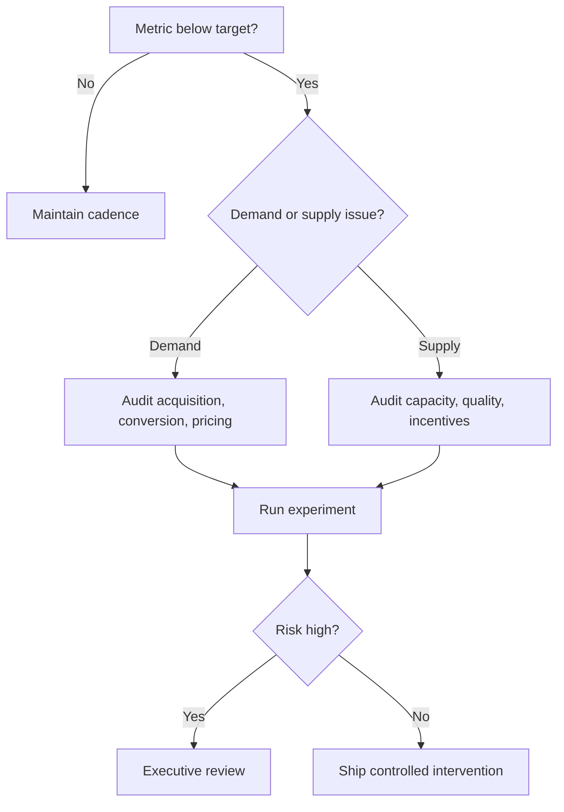

# Operations

## Objective

Build an expert operating blueprint for operations in a marketplace business, from first principles to board-ready execution.

## Why This Module Matters

Operations determines whether a marketplace can create reliable liquidity, defend trust, and scale without losing unit-economic discipline. Weakness here compounds across demand, supply, product, finance, and legal exposure.

## Learning Outcomes

- Define the role of operations in marketplace architecture.
- Diagnose marketplace failure modes using metrics and qualitative evidence.
- Design policies, systems, and operating cadences that can scale across cities and categories.
- Translate strategy into SOPs, dashboards, experiments, and accountable owners.

## Prerequisites

- Basic marketplace vocabulary: GMV, take rate, CAC, LTV, liquidity, conversion, cohort, SLA.
- Access to demand, supply, finance, support, and compliance data.
- A named owner empowered to change process, product, and policy.

## Core Concepts

### Liquidity
Definition: liquidity is a core marketplace design variable affecting operations. Purpose: improve reliability and economic efficiency. Importance: mismanaging it creates hidden scale debt. Advantages: clearer decisions and faster iteration. Disadvantages: local optimization can harm the network. Real-world usage: Uber, Airbnb, Amazon Marketplace, Urban Company, DoorDash, Fiverr, Upwork, Etsy, Zomato, and Swiggy tune this continuously. Examples: category-specific thresholds, city-level playbooks, and risk-tiered workflows. Common mistakes: copying another marketplace without adapting density, regulation, and trust context. Advanced concepts: causal measurement, mechanism design, and AI-assisted operations. Future trends: autonomous agents, embedded finance, privacy-preserving analytics, and regulator-readable audit trails.

### Trust
Definition: trust is a core marketplace design variable affecting operations. Purpose: improve reliability and economic efficiency. Importance: mismanaging it creates hidden scale debt. Advantages: clearer decisions and faster iteration. Disadvantages: local optimization can harm the network. Real-world usage: Uber, Airbnb, Amazon Marketplace, Urban Company, DoorDash, Fiverr, Upwork, Etsy, Zomato, and Swiggy tune this continuously. Examples: category-specific thresholds, city-level playbooks, and risk-tiered workflows. Common mistakes: copying another marketplace without adapting density, regulation, and trust context. Advanced concepts: causal measurement, mechanism design, and AI-assisted operations. Future trends: autonomous agents, embedded finance, privacy-preserving analytics, and regulator-readable audit trails.

### Take Rate
Definition: take rate is a core marketplace design variable affecting operations. Purpose: improve reliability and economic efficiency. Importance: mismanaging it creates hidden scale debt. Advantages: clearer decisions and faster iteration. Disadvantages: local optimization can harm the network. Real-world usage: Uber, Airbnb, Amazon Marketplace, Urban Company, DoorDash, Fiverr, Upwork, Etsy, Zomato, and Swiggy tune this continuously. Examples: category-specific thresholds, city-level playbooks, and risk-tiered workflows. Common mistakes: copying another marketplace without adapting density, regulation, and trust context. Advanced concepts: causal measurement, mechanism design, and AI-assisted operations. Future trends: autonomous agents, embedded finance, privacy-preserving analytics, and regulator-readable audit trails.

### Quality Control
Definition: quality control is a core marketplace design variable affecting operations. Purpose: improve reliability and economic efficiency. Importance: mismanaging it creates hidden scale debt. Advantages: clearer decisions and faster iteration. Disadvantages: local optimization can harm the network. Real-world usage: Uber, Airbnb, Amazon Marketplace, Urban Company, DoorDash, Fiverr, Upwork, Etsy, Zomato, and Swiggy tune this continuously. Examples: category-specific thresholds, city-level playbooks, and risk-tiered workflows. Common mistakes: copying another marketplace without adapting density, regulation, and trust context. Advanced concepts: causal measurement, mechanism design, and AI-assisted operations. Future trends: autonomous agents, embedded finance, privacy-preserving analytics, and regulator-readable audit trails.

### Disintermediation
Definition: disintermediation is a core marketplace design variable affecting operations. Purpose: improve reliability and economic efficiency. Importance: mismanaging it creates hidden scale debt. Advantages: clearer decisions and faster iteration. Disadvantages: local optimization can harm the network. Real-world usage: Uber, Airbnb, Amazon Marketplace, Urban Company, DoorDash, Fiverr, Upwork, Etsy, Zomato, and Swiggy tune this continuously. Examples: category-specific thresholds, city-level playbooks, and risk-tiered workflows. Common mistakes: copying another marketplace without adapting density, regulation, and trust context. Advanced concepts: causal measurement, mechanism design, and AI-assisted operations. Future trends: autonomous agents, embedded finance, privacy-preserving analytics, and regulator-readable audit trails.

## Chapters

1. First-principles view of Operations
2. Operating model and ownership
3. Metrics, instrumentation, and governance
4. Product, policy, and process design
5. Scaling, compliance, and automation

## Topics

- Strategy: how operations supports marketplace liquidity.
- Product: screens, data models, permissions, and workflows.
- Operations: staffing, SLAs, quality, escalation, and audit.
- Finance: revenue, cost, cash, risk reserves, and accounting impact.
- Legal: India-specific and global obligations when applicable.

## Subtopics

- Define the subtopics for operations with clear owners, inputs, outputs, and measurable standards.
- Use this section to convert strategy into repeatable management practice rather than one-off founder intuition.
- Review monthly during scale-up and quarterly after stabilization.

## Micro Topics

- Define the micro topics for operations with clear owners, inputs, outputs, and measurable standards.
- Use this section to convert strategy into repeatable management practice rather than one-off founder intuition.
- Review monthly during scale-up and quarterly after stabilization.

## Frameworks

### Marketplace Control Loop
Explanation: a recurring loop that senses marketplace health, decides interventions, executes changes, and measures outcomes.

Advantages: prevents anecdote-driven management. Disadvantages: requires high-quality data and operating discipline. Examples: city launch war rooms, fraud review queues, pricing experiments, and worker quality scorecards.

## Models

- Two-sided liquidity model: balance demand arrival rate with supply availability and service capacity.
- Quality-risk model: segment participants by history, verification depth, complaint rate, and transaction value.
- Contribution model: GMV × take rate − variable incentives − payment costs − support costs − refunds − claims.

## Algorithms

Use ranking, routing, anomaly detection, queue prioritization, propensity scoring, causal uplift, and optimization algorithms. Start with transparent rules; graduate to ML only after instrumentation, labels, monitoring, and human override exist.

## Mathematical Formulas

- Contribution Margin = Revenue − Variable Costs.
- Take Rate = Net Revenue / GMV.
- Liquidity = Successful Matches / Qualified Requests.
- SLA Attainment = On-time Completed Jobs / Total Completed Jobs.
- Cohort Retention = Active Users in Period N / Users Acquired in Period 0.

## Industry Terminology

- Define the industry terminology for operations with clear owners, inputs, outputs, and measurable standards.
- Use this section to convert strategy into repeatable management practice rather than one-off founder intuition.
- Review monthly during scale-up and quarterly after stabilization.

## Marketplace Metrics

- Define the marketplace metrics for operations with clear owners, inputs, outputs, and measurable standards.
- Use this section to convert strategy into repeatable management practice rather than one-off founder intuition.
- Review monthly during scale-up and quarterly after stabilization.

## KPIs

| KPI | Formula | Purpose | Benchmark | Warning levels | Improvement methods |
|---|---:|---|---|---|---|
| Liquidity rate | Successful matches / qualified requests | Measures market reliability | 60-90% depending on category | Falling 3 periods or below city target | Add supply, adjust price, reduce friction |
| Contribution margin | Revenue - variable costs | Tests economic quality | Positive by mature cohort | Negative after incentive normalization | Reprice, reduce support cost, improve routing |
| Complaint rate | Complaints / completed orders | Tracks trust | Category specific, trend down | Spike by cohort, vendor, city | Retrain, suspend, inspect, redesign policy |

## SOPs

### SOP: Weekly Operations Business Review
Purpose: detect issues and assign corrective action. Inputs: dashboard, customer tickets, worker feedback, finance reports, experiment results. Outputs: decisions, owners, deadlines, risk log. Roles: GM, product, ops, finance, legal, data, support. Responsibilities: data validates metrics; ops explains variance; product owns system fixes; legal flags obligations. Step-by-step process: 1) review north-star metric, 2) inspect funnel and cohorts, 3) identify outliers, 4) choose intervention, 5) document decision, 6) follow up next week. Escalation: material legal, safety, payment, or reputational risk goes to executive incident channel within 24 hours. KPIs: action closure rate, metric recovery time, incident recurrence. Risks: vanity metrics, unowned actions, and local fixes that break global policy. Checklist: agenda, dashboard, owner, due date, decision log, customer impact, compliance review.

## Workflows

- Define the workflows for operations with clear owners, inputs, outputs, and measurable standards.
- Use this section to convert strategy into repeatable management practice rather than one-off founder intuition.
- Review monthly during scale-up and quarterly after stabilization.

## Checklists

- Define the checklists for operations with clear owners, inputs, outputs, and measurable standards.
- Use this section to convert strategy into repeatable management practice rather than one-off founder intuition.
- Review monthly during scale-up and quarterly after stabilization.

## Decision Trees

## Research Tasks

- Define the research tasks for operations with clear owners, inputs, outputs, and measurable standards.
- Use this section to convert strategy into repeatable management practice rather than one-off founder intuition.
- Review monthly during scale-up and quarterly after stabilization.

## Practical Assignments

- Define the practical assignments for operations with clear owners, inputs, outputs, and measurable standards.
- Use this section to convert strategy into repeatable management practice rather than one-off founder intuition.
- Review monthly during scale-up and quarterly after stabilization.

## Exercises

- Define the exercises for operations with clear owners, inputs, outputs, and measurable standards.
- Use this section to convert strategy into repeatable management practice rather than one-off founder intuition.
- Review monthly during scale-up and quarterly after stabilization.

## Mini Projects

- Define the mini projects for operations with clear owners, inputs, outputs, and measurable standards.
- Use this section to convert strategy into repeatable management practice rather than one-off founder intuition.
- Review monthly during scale-up and quarterly after stabilization.

## Capstone Project

- Define the capstone project for operations with clear owners, inputs, outputs, and measurable standards.
- Use this section to convert strategy into repeatable management practice rather than one-off founder intuition.
- Review monthly during scale-up and quarterly after stabilization.

## Case Studies

### Case Study: Applying Operations to a City Marketplace
Background: a local services marketplace entered a new city with strong demand but inconsistent provider reliability. Problem: liquidity looked healthy in aggregate while premium neighborhoods had poor completion rates. Decision: split metrics by zone, time slot, provider tier, and job type. Execution: added targeted onboarding, price floors, worker training, and daily exception review. Result: completion improved, refunds declined, and contribution margin stabilized. Lessons Learned: averages hide marketplace failure; density and trust must be managed at the operating-cell level.

## Real Company Examples

- Define the real company examples for operations with clear owners, inputs, outputs, and measurable standards.
- Use this section to convert strategy into repeatable management practice rather than one-off founder intuition.
- Review monthly during scale-up and quarterly after stabilization.

## Founder Insights

- Define the founder insights for operations with clear owners, inputs, outputs, and measurable standards.
- Use this section to convert strategy into repeatable management practice rather than one-off founder intuition.
- Review monthly during scale-up and quarterly after stabilization.

## Best Practices

- Define the best practices for operations with clear owners, inputs, outputs, and measurable standards.
- Use this section to convert strategy into repeatable management practice rather than one-off founder intuition.
- Review monthly during scale-up and quarterly after stabilization.

## Common Mistakes

- Define the common mistakes for operations with clear owners, inputs, outputs, and measurable standards.
- Use this section to convert strategy into repeatable management practice rather than one-off founder intuition.
- Review monthly during scale-up and quarterly after stabilization.

## Risks

- Define the risks for operations with clear owners, inputs, outputs, and measurable standards.
- Use this section to convert strategy into repeatable management practice rather than one-off founder intuition.
- Review monthly during scale-up and quarterly after stabilization.

## Red Flags

- Define the red flags for operations with clear owners, inputs, outputs, and measurable standards.
- Use this section to convert strategy into repeatable management practice rather than one-off founder intuition.
- Review monthly during scale-up and quarterly after stabilization.

## Compliance Requirements

India: evaluate GST, TDS/TCS, Consumer Protection Act, DPDP Act, IT Act, labour-code classification risk, RBI payment aggregation rules, UPI flows, Razorpay/Cashfree settlement, invoice requirements, and grievance officer obligations. Global: evaluate GDPR, PCI DSS, SOC 2, ISO 27001, KYC, AML, sanctions/OFAC screening, consumer law, worker classification, tax nexus, insurance, and data residency. This is operational guidance, not legal advice; counsel must review market-specific implementation.

## Legal Considerations

India: evaluate GST, TDS/TCS, Consumer Protection Act, DPDP Act, IT Act, labour-code classification risk, RBI payment aggregation rules, UPI flows, Razorpay/Cashfree settlement, invoice requirements, and grievance officer obligations. Global: evaluate GDPR, PCI DSS, SOC 2, ISO 27001, KYC, AML, sanctions/OFAC screening, consumer law, worker classification, tax nexus, insurance, and data residency. This is operational guidance, not legal advice; counsel must review market-specific implementation.

## Security Considerations

Apply least privilege, encryption in transit and at rest, secure payment tokenization, audit logs, vulnerability management, incident response, vendor risk review, access recertification, secrets management, and privacy-by-design. High-risk workflows need maker-checker approval and immutable logs.

## AI Opportunities

AI can improve pricing, fraud detection, matching, support triage, forecasting, risk analysis, quality control, document review, KYC anomaly detection, cohort segmentation, and playbook generation. Require model monitoring, explainability for adverse actions, bias testing, human appeal, and data minimization.

## Automation Opportunities

- Define the automation opportunities for operations with clear owners, inputs, outputs, and measurable standards.
- Use this section to convert strategy into repeatable management practice rather than one-off founder intuition.
- Review monthly during scale-up and quarterly after stabilization.

## Recommended Tools

- Define the recommended tools for operations with clear owners, inputs, outputs, and measurable standards.
- Use this section to convert strategy into repeatable management practice rather than one-off founder intuition.
- Review monthly during scale-up and quarterly after stabilization.

## APIs

- Define the apis for operations with clear owners, inputs, outputs, and measurable standards.
- Use this section to convert strategy into repeatable management practice rather than one-off founder intuition.
- Review monthly during scale-up and quarterly after stabilization.

## Integrations

- Define the integrations for operations with clear owners, inputs, outputs, and measurable standards.
- Use this section to convert strategy into repeatable management practice rather than one-off founder intuition.
- Review monthly during scale-up and quarterly after stabilization.

## Software Stack

- Define the software stack for operations with clear owners, inputs, outputs, and measurable standards.
- Use this section to convert strategy into repeatable management practice rather than one-off founder intuition.
- Review monthly during scale-up and quarterly after stabilization.

## Books

- Define the books for operations with clear owners, inputs, outputs, and measurable standards.
- Use this section to convert strategy into repeatable management practice rather than one-off founder intuition.
- Review monthly during scale-up and quarterly after stabilization.

## Research Papers

- Define the research papers for operations with clear owners, inputs, outputs, and measurable standards.
- Use this section to convert strategy into repeatable management practice rather than one-off founder intuition.
- Review monthly during scale-up and quarterly after stabilization.

## Blogs

- Define the blogs for operations with clear owners, inputs, outputs, and measurable standards.
- Use this section to convert strategy into repeatable management practice rather than one-off founder intuition.
- Review monthly during scale-up and quarterly after stabilization.

## YouTube Channels

- Define the youtube channels for operations with clear owners, inputs, outputs, and measurable standards.
- Use this section to convert strategy into repeatable management practice rather than one-off founder intuition.
- Review monthly during scale-up and quarterly after stabilization.

## Podcasts

- Define the podcasts for operations with clear owners, inputs, outputs, and measurable standards.
- Use this section to convert strategy into repeatable management practice rather than one-off founder intuition.
- Review monthly during scale-up and quarterly after stabilization.

## Websites

- Define the websites for operations with clear owners, inputs, outputs, and measurable standards.
- Use this section to convert strategy into repeatable management practice rather than one-off founder intuition.
- Review monthly during scale-up and quarterly after stabilization.

## Templates

- Operations one-page strategy memo.
- Weekly business review scorecard.
- Risk register and decision log.
- Experiment brief and postmortem.

## Deliverables

- Define the deliverables for operations with clear owners, inputs, outputs, and measurable standards.
- Use this section to convert strategy into repeatable management practice rather than one-off founder intuition.
- Review monthly during scale-up and quarterly after stabilization.

## Self Assessment Questions

- Define the self assessment questions for operations with clear owners, inputs, outputs, and measurable standards.
- Use this section to convert strategy into repeatable management practice rather than one-off founder intuition.
- Review monthly during scale-up and quarterly after stabilization.

## Completion Checklist

- [ ] Objectives documented.
- [ ] Metrics instrumented.
- [ ] SOP owner assigned.
- [ ] Legal and security review complete.
- [ ] Dashboard reviewed in operating cadence.
- [ ] Risks logged with mitigation and escalation path.
