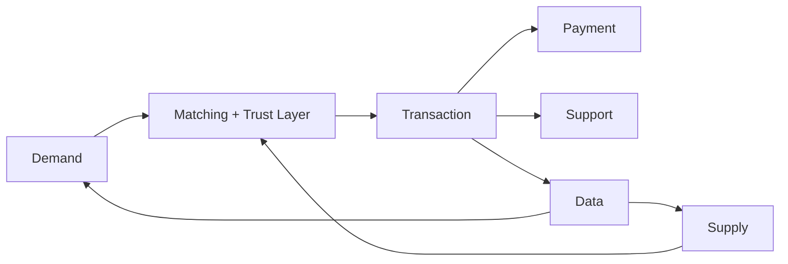

# Introduction

This handbook treats a marketplace as an economic institution, software system, operating machine, and trust network. It is written for founders, operators, product leaders, investors, consultants, and architects who need a complete blueprint rather than slogans.

